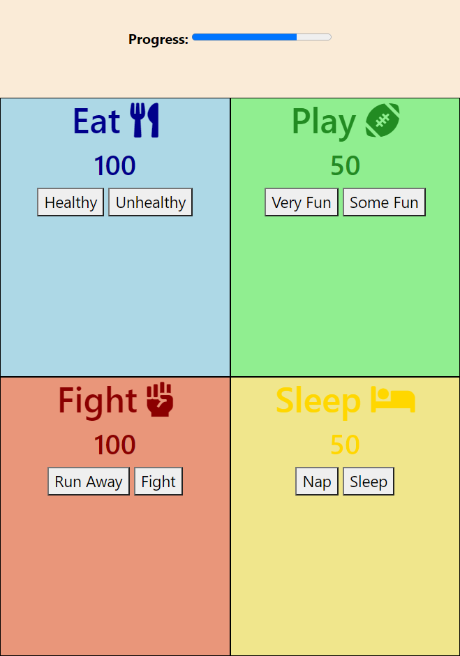

# Tamagotchi
This project was meant as an entry into Sass. The project features four quadrants that display different things you can do with your Tamagotchi, including sleeping, fighting, eating, and playing! Each section also features a button that when clicked effects the energy level of each activity. It's a fun little project, please check it out and enjoy!

## Technology used
- HTML
- Javascript and Jquery
- Sass
- Webpack

## Netlify
[](https://app.netlify.com/sites/sharp-aryabhata-6c0aea/deploys)
Checkout [the project!](https://sharp-aryabhata-6c0aea.netlify.app/)

## Code Snippets
### Javascript @icn-camera
```javascript
const eatingButtons = () => {
  $('#goodFood').on('click', () => {
    $('#health').html('');
    $('#health').html(`<h2>${eatButtonGood()}</h2>`);
  });
  $('#badFood').on('click', () => {
    $('#health').html('');
    $('#health').html(`<h2>${eatButtonBad()}</h2>`);
  });
};

export default { eatingButtons, eatDom, full };
```
### Sass 
```scss
#app {
  display: flex;
  flex-wrap: wrap;
  .quad {
    width: 50%;
    height: 20rem;
  }
}
```
